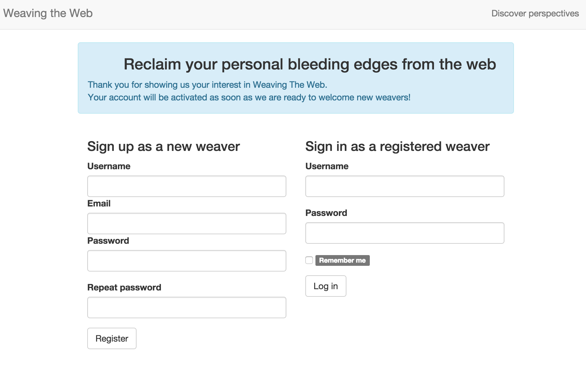

# User management

## Login as an identified user
 
You can either

 1. login as `tester` by using the following credentials  
 (user identified as `tester` is loaded into the development database at deployment to the vagrant box)
 
 ```
 # username
 tester

 # password
 test
 ```     
 
 or

 2. sign up to create a new account, activate this account (newly created accounts are disabled by default)
 and login as the newly created user

After signing up, you should see the following message inviting you to wait for account activation:

[](http://10.9.8.2)

In order to activate an account you've created for trial, run the following command:

```
export USER='Your canonical username here' && \
source bin/activate-user $USER
```

## Make a user a super administrator 

A user who has been granted the `SUPER_ADMIN` role is able to manage jobs, perspectives and documents

Run the following command to promote a existing user:

```
export USER='Your canonical username here' && \
source bin/promote-user-as-super-admin $USER
```
