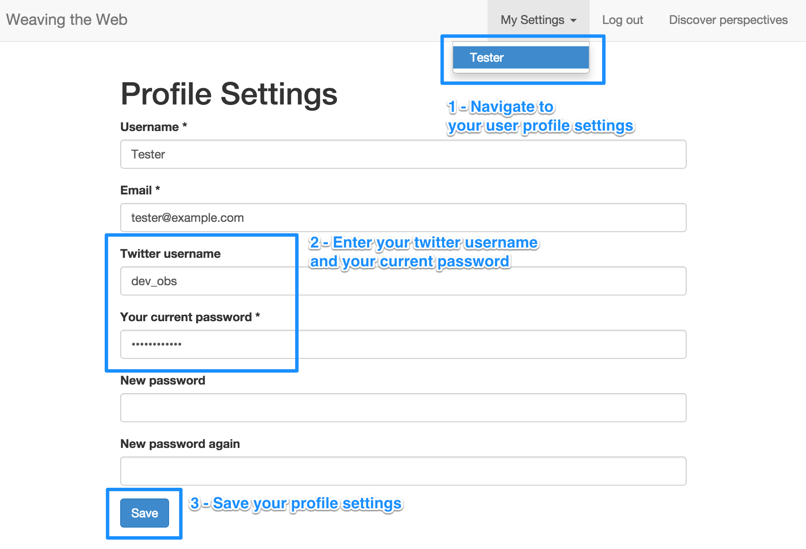
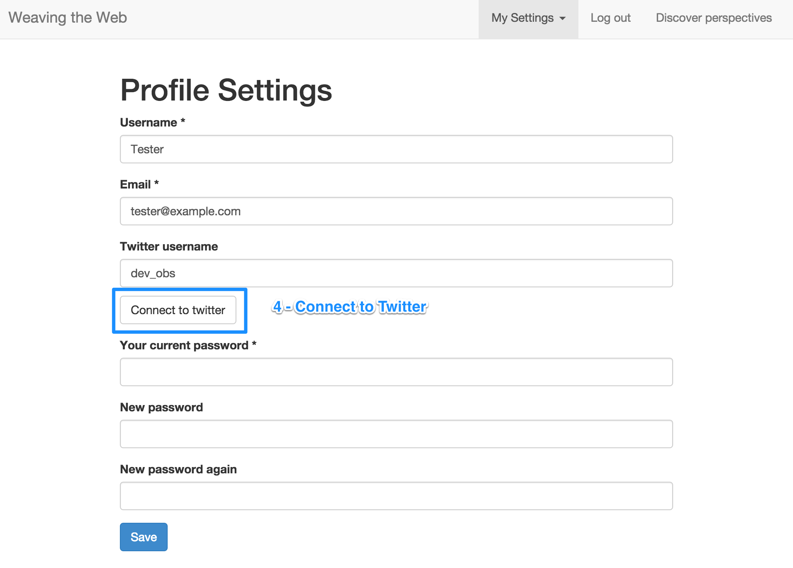
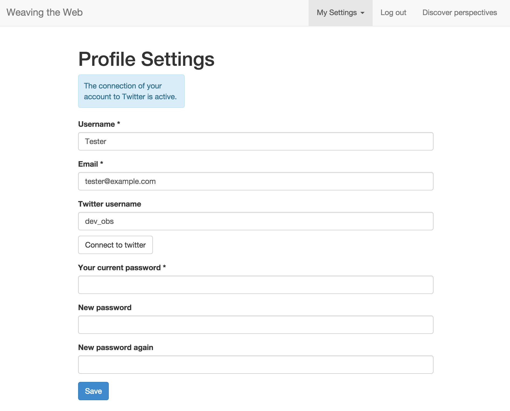

# Connect your user account to Twitter

## Requirements

You need a Twitter account before going further. 
You can sign up to create one from [https://twitter.com/signup](https://twitter.com/signup)

Create a new Twitter App by following instructions from [https://apps.twitter.com/](https://apps.twitter.com/).
The callback URL to provide should be [http://10.9.8.2/twitter/login_check](http://10.9.8.2/twitter/login_check).

Please note the Twitter account to be used to create an application has to be associated to a mobile phone.

Update the following configuration parameters of your Symfony application:

```
SYMFONY__API__TWITTER__CONSUMER_KEY
SYMFONY__API__TWITTER__CONSUMER_SECRET
SYMFONY__API__TWITTER__CALLBACK_URL
```

The values of the environment variables above have to be updated  
in the following files before any provisioning or deployment

 * `config/export-development-environment-variables.sh`
 * `provisioning/roles/php/templates/pool_twitter.conf.tpl`
 
To provision the vagrant box again after having updated the PHP fpm pool configuration, 
run the following command

```
# create a virtual environment
virtualenv vendor/devobs

# install ansible and its requirements 
pip install -r provisioning/ansible.txt

# activate the newly created virtual environment
source vendor/devobs/bin/activate

# copy the devobs PHP fpm pool 
cp provisioning/roles/php/templates/pool{,_twitter}.conf.tpl

# update Twitter consumer key and consumer secret
export CONSUMER_KEY='key'
export CONSUMER_SECRET='secret'

# replace consumer key in export environment variables script
sed -e "s/SYMFONY__API__TWITTER__CONSUMER_KEY=\"_\"/SYMFONY__API__TWITTER__CONSUMER_KEY=\""$CONSUMER_KEY"\"/g" \
config/export-development-environment-variables.sh.dist > /tmp/export-development-environment-variables.sh.tpl

# replace consumer secret in export environment variables script
sed -e "s/SYMFONY__API__TWITTER__CONSUMER_SECRET=\"_\"/SYMFONY__API__TWITTER__CONSUMER_SECRET=\""$CONSUMER_SECRET"\"/g" \
/tmp/export-development-environment-variables.sh.tpl > config/export-development-environment-variables.sh

# replace script in vagrant box
vagrant ssh -c 'cp /vagrant/config/export-development-environment-variables.sh /var/deploy/devobs/current/config'

# replace consumer key in pool template
sed -e "s/SYMFONY__API__TWITTER__CONSUMER_KEY]='_'/SYMFONY__API__TWITTER__CONSUMER_KEY]='"$CONSUMER_KEY"'/g" \
provisioning/roles/php/templates/pool.conf.tpl > provisioning/roles/php/templates/pool.conf.tpl_

# replace consumer secret in pool template
sed -e "s/SYMFONY__API__TWITTER__CONSUMER_SECRET]='_'/SYMFONY__API__TWITTER__CONSUMER_SECRET]='"$CONSUMER_SECRET"'/g" \
provisioning/roles/php/templates/pool.conf.tpl_ > provisioning/roles/php/templates/pool_twitter.conf.tpl

# remove temporary file
rm provisioning/roles/php/templates/pool.conf.tpl_

# run the tasks tagged with "php"
PHP_FPM_POOL=_twitter vendor/devobs/bin/ansible-playbook --user=vagrant --connection=ssh --timeout=30 --limit=all \
--inventory-file=provisioning/inventories/dev provisioning/playbook.yml  \
--private-key=./.vagrant/machines/default/virtualbox/private_key -t php

# deactivate the virtual environment
deactivate
```
 
## Connection

 1. *Go to your profile settings*
 
 Navigate to the settings of your user account:

  * click on **My Settings** menu to open its sub-menu,
  * click on your username  
   *e.g.* "Tester" if you're impersonating the testing account loaded by default
 
 or enter the following URL in the address bar: [http://HOSTNAME/user/settings](http://10.9.8.2/user/settings)  
  *e.g.* http://10.9.8.2/user/settings when relying on the pre-packaged vagrant box.

 2. *Update your Twitter username*
 
 Enter your twitter username and your current password

 3. *Submit the profile settings*
 
 Click on the **Save** button to connect your Twitter account
 
 4. *Connect to Twitter*
 
 Click on the **Connect to Twitter** button to connect to Twitter

[](http://10.9.8.2/user/settings)

[](http://10.9.8.2/user/settings)

[](http://10.9.8.2/user/settings)
