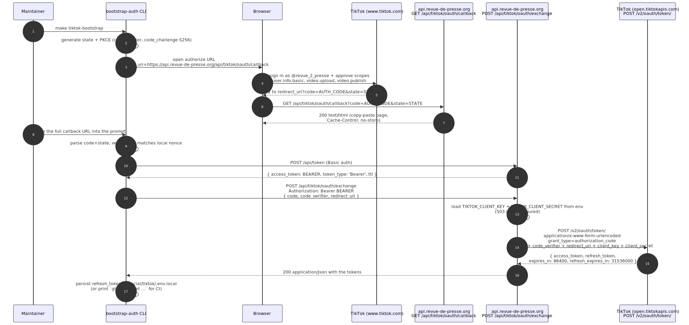
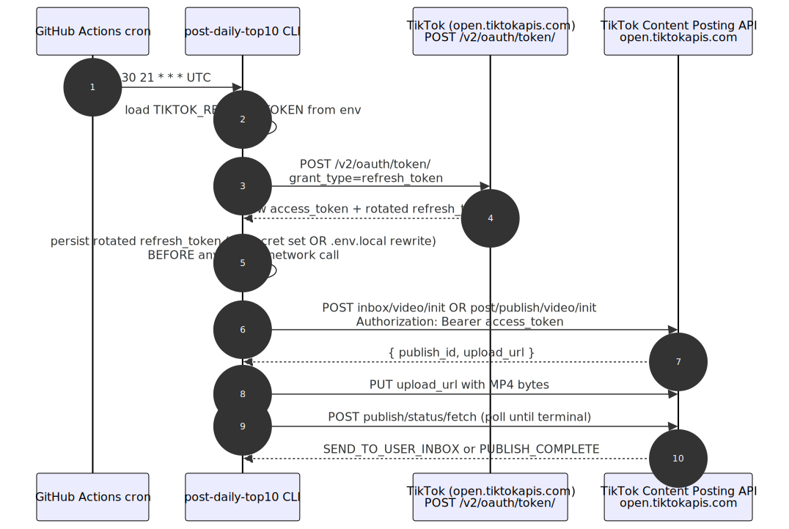

# TikTok OAuth — implemented workflow

`api.revue-de-presse.org` exposes a TikTok OAuth callback + server-side
authorization-code exchange so the daily TikTok-shorts publisher (lives in
`org.revue-de-presse.benchmark/social/tiktok/`) can obtain TikTok access
tokens without binding to a non-public redirect URI.

The same contract is implemented twice — once in **NestJS** (`nestjs/`) and
once in **Symfony + API Platform** (`src/`). Whichever container is
currently serving `api.revue-de-presse.org`, the routes and responses are
identical.

## At a glance

| Endpoint | Method | Auth | Purpose |
|---|---|---|---|
| `/api/tiktok/oauth/callback` | `GET` | public | Receives TikTok's `?code=&state=` redirect; renders a copy-paste HTML page for the maintainer. |
| `/api/tiktok/oauth/exchange` | `POST` | bearer (`POST /api/token` flow) | Server-side exchange of `code` → tokens via TikTok's `/v2/oauth/token/`. |

| Env | Required for | Notes |
|---|---|---|
| `TIKTOK_CLIENT_KEY` | `/api/tiktok/oauth/exchange` | When unset, the exchange returns `503`. The callback works regardless. |
| `TIKTOK_CLIENT_SECRET` | `/api/tiktok/oauth/exchange` | Server-only. Never sent to clients. |

## Component layout



> Source: [`assets/tiktok-api/01-component-layout.mmd`](assets/tiktok-api/01-component-layout.mmd) — regenerate with `mmdc -i assets/tiktok-api/01-component-layout.mmd -o assets/tiktok-api/01-component-layout.svg -b white`.

Only one adapter (NestJS or Symfony) actually serves the request — the two
boxes represent the same HTTP surface implemented in two stacks.

## Sequence — bootstrap (one-time, interactive)



> Source: [`assets/tiktok-api/02-bootstrap-sequence.mmd`](assets/tiktok-api/02-bootstrap-sequence.mmd).

After this single round, the daily cron uses the persisted `refresh_token`
to mint a fresh `access_token` every 24 h. The redirect URI is never
touched again until the `refresh_token` expires (≈365 days) or is revoked.

## Sequence — daily run (no callback involvement)



> Source: [`assets/tiktok-api/03-daily-run-sequence.mmd`](assets/tiktok-api/03-daily-run-sequence.mmd).

The daily path bypasses the api entirely. That is deliberate — the api's
role is to host the callback URL TikTok will accept and to broker the
one-time `code → tokens` exchange. Daily refreshes do not require any
proxy.

## Endpoint contract (both adapters)

### `GET /api/tiktok/oauth/callback`

Public — no `Authorization` header required.

| Query | Effect |
|---|---|
| `code` + `state` both present | 200 `text/html; charset=utf-8` with a copy-paste page showing the full callback URL. `Cache-Control: no-store`. |
| `error` present | 400 `application/problem+json`, `title: "TikTok OAuth error"`, `detail` = TikTok's error description. |
| `code` or `state` missing | 400 `application/problem+json` with explicit message. |

The HTML payload renders all query values through HTML-escape; nothing
user-controlled is interpolated raw.

### `POST /api/tiktok/oauth/exchange`

Bearer-gated by the existing access-token firewall (NestJS `BearerGuard`,
Symfony `access_token` firewall — same effect).

Request body (`application/json`):

```json
{
  "code":          "AUTH_CODE_FROM_CALLBACK",
  "code_verifier": "PKCE_VERIFIER_FROM_CLI",
  "redirect_uri":  "https://api.revue-de-presse.org/api/tiktok/oauth/callback"
}
```

Responses:

| Status | Body | When |
|---|---|---|
| `200` | `{ access_token, refresh_token, expires_in, refresh_expires_in, scope?, open_id? }` | TikTok returned tokens successfully. |
| `400` | `application/problem+json` | Body validation failed OR TikTok returned a 4xx (TikTok's response is forwarded in `detail`). |
| `401` | (firewall) | Missing or invalid bearer. |
| `503` | `application/problem+json` | `TIKTOK_CLIENT_KEY` or `TIKTOK_CLIENT_SECRET` is unset on the server. |

## File map

### NestJS adapter (`nestjs/`)

| Path | Role |
|---|---|
| `src/adapters/nestjs/tiktok/tiktok.module.ts` | Module wiring (controller + `TIKTOK_OAUTH_CLIENT` provider factory). |
| `src/adapters/nestjs/tiktok/tiktok-oauth.controller.ts` | Both endpoints; `@Public()` on the callback, default `BearerGuard` on the exchange. |
| `src/adapters/nestjs/tiktok/tiktok-oauth-exchange.dto.ts` | Swagger DTO for the request body. |
| `src/core/tiktok/tiktok-oauth.client.ts` | `TikTokOAuthClient` interface + `HttpTikTokOAuthClient` real impl + `UnconfiguredTikTokOAuthClient` placeholder. |
| `src/core/tiktok/tiktok-oauth.types.ts` | zod schemas (`TokenResponseSchema`). |
| `src/core/tiktok/tiktok-oauth.errors.ts` | `TikTokExchangeError`, `TikTokInvalidResponseError`. |
| `src/config/env.ts` | Adds optional `TIKTOK_CLIENT_KEY` + `TIKTOK_CLIENT_SECRET`. |
| `test/unit/tiktok/http-tiktok-oauth-client.spec.ts` | Pure unit (constructor-injected fake `fetch`). |
| `test/e2e/tiktok-oauth-callback.e2e-spec.ts` | 6 cases: happy HTML, HTML-escape, missing-code, missing-state, error param, public reachability. |
| `test/e2e/tiktok-oauth-exchange.e2e-spec.ts` | 5 cases: happy 200, upstream 4xx → 400, malformed body → 400, no bearer → 401, missing creds → 503. |
| `test/doubles/fake-tiktok-oauth.client.ts` | In-memory fake injected via `.overrideProvider(TIKTOK_OAUTH_CLIENT)`. |

Mock seam: the e2e exchange test swaps the `TIKTOK_OAUTH_CLIENT` provider
for the in-memory fake via Nest DI override; the unit suite injects a
fake `fetch` directly into the `HttpTikTokOAuthClient` constructor.

### Symfony / API Platform adapter (`src/`)

| Path | Role |
|---|---|
| `src/TikTok/Domain/TikTokTokenResponse.php` | Readonly VO with `::fromArray` validation + `toArray` pass-through. |
| `src/TikTok/Infrastructure/Controller/TikTokOAuthCallbackController.php` | `#[Route('/api/tiktok/oauth/callback', methods: ['GET'])]`. Public by `security.yaml` access_control. |
| `src/TikTok/Infrastructure/Controller/TikTokOAuthExchangeController.php` | `#[Route('/api/tiktok/oauth/exchange', methods: ['POST'])]`. Gated by the default `access_token` firewall. |
| `src/TikTok/Infrastructure/Http/TikTokOAuthClient.php` | Interface. |
| `src/TikTok/Infrastructure/Http/HttpTikTokOAuthClient.php` | Symfony `HttpClientInterface`-backed real impl. |
| `src/TikTok/Infrastructure/Http/TikTokExchangeException.php` | Wraps upstream non-2xx with `getDetail()`. |
| `src/TikTok/Infrastructure/Http/UnconfiguredTikTokClientException.php` | Thrown when env vars are missing. |
| `config/routes/annotations.yaml` | `tiktok:` scan block (registers `#[Route]` discovery). |
| `config/packages/security.yaml` | Adds `^/api/tiktok/oauth/callback → PUBLIC_ACCESS` in all 3 env blocks. |
| `config/services.yaml` | Explicit service entries (this codebase does not glob-autowire). |
| `config/services_test.yaml` | Test-only `MockHttpClient` swap (public id `app.test.tiktok_mock_http_client`). |
| `.env.local.dist` / `.env.test.dist` | Empty `TIKTOK_CLIENT_KEY=` / `TIKTOK_CLIENT_SECRET=` placeholders. |
| `tests/TikTok/Infrastructure/Controller/TikTokOAuthCallbackControllerTest.php` | 6 WebTestCase cases (same matrix as NestJS). |
| `tests/TikTok/Infrastructure/Controller/TikTokOAuthExchangeControllerTest.php` | 5 WebTestCase cases; 503 case swaps the wired client for an anonymous-class stub. |
| `tests/TikTok/Infrastructure/Http/HttpTikTokOAuthClientTest.php` | 5 unit tests with `MockHttpClient` (form body encoding, 4xx, schema mismatch, happy DTO, unconfigured). |

Mock seam: `MockHttpClient` (from `symfony/http-client`) is the canonical
outbound-HTTP mock; the e2e test fetches it from the container under the
stable id `app.test.tiktok_mock_http_client` and primes `MockResponse`
queues per case.

## Why two adapters

Both stacks live in the same repo because Symfony is the historical /
production stack and NestJS is the in-flight rewrite. Either may be the
container actually serving `api.revue-de-presse.org` during the
migration. Implementing the contract in both keeps the rewrite
deployable in either direction without breaking the TikTok-shorts
publisher's expectation of a stable redirect URI.

The contracts are kept byte-identical (same paths, same response
shapes, same error wording on the callback). End-to-end behavior is the
same regardless of which adapter currently owns the route.

## Why the api hosts the callback at all

The TikTok developer portal's *Login Kit → Redirect URI* field enforces
two constraints that ruled out the maintainer's laptop:

1. **HTTPS required** — `http://localhost:54545/callback` is rejected.
2. **Public domain required** — `https://localhost:54545/callback` is
   also rejected (the host must resolve from outside the maintainer's
   network at portal-registration time).

`https://api.revue-de-presse.org/api/tiktok/oauth/callback` satisfies
both because the api is already deployed on a public HTTPS endpoint.
The callback handler intentionally does nothing security-sensitive — it
only displays the `code` so the maintainer can finish the flow on their
laptop. The code itself is single-use and short-lived; intercepting the
HTML page yields no usable secret because the exchange must be
completed with the matching PKCE `code_verifier` that never leaves the
CLI.

## Security model

- **Callback** is `PUBLIC_ACCESS` but never stores anything, never calls
  TikTok server-side, and never echoes user-controlled values without
  HTML-escape. `Cache-Control: no-store` prevents any intermediate from
  caching the code.
- **Exchange** requires the same `Bearer` token as every other
  authenticated endpoint on the api (minted via `POST /api/token` Basic
  auth). The `TIKTOK_CLIENT_SECRET` never leaves the server.
- **PKCE** S256 binds the `code` to a `code_verifier` known only to the
  bootstrapping CLI. Even if the callback page were intercepted in
  transit, the exchange request must include the matching verifier.
- **No token storage on the api.** The api returns the tokens to the
  caller and forgets them. Refresh-token persistence is the caller's
  responsibility (`social/tiktok/.env.local` locally, GitHub Secrets in
  CI).
